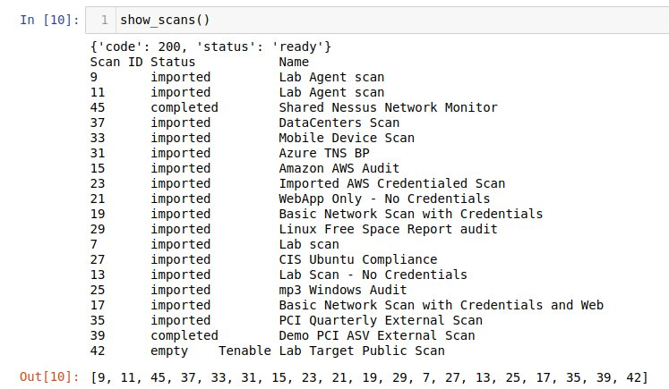

# Pytenable

This repo will have updated versions of the functions and libraries created for MPIV using Pytenable, Navi or Tenable API's

## MPIV Libraries

Generally speaking, all API projects will be created as independent libraries, each one with unique functions that can be used according to specific needs. By using functions, we simplify the usage for customers and we can have more control on the user input, also easing code reuse for different projects.

Current status of MPIV libraries is detailed at: https://github.com/jumedata/pytenable - Only accesible to Oporto, Garcia and Meneses. 

Currently there are two libraries:

### mpiv_io_lib.py  
This library allows the usage of pytenable and Tenable.io

#### Available functions

**connect_IO():**  
This Function connects to Tenable.io using API Keys    

**show_scans():**  
Shows all scans available in T.io    

  

**vul_report(\*args, filename):**  
Generates a .csv report  

See [Example Vulns Report](outputfiles/Example_vulns_repo.csv)

**get_asset_list:()**  
Returns a list of dictionaries with the assets info  

**get_tag_list():**  
Returns a list of dictionaries with tags info  

**asset_report(filename):**  
Generates a csv file with the list of assets found in Tenable.io  

See [Example Assets Report](outputfiles/Example_asset_repo.csv)
 
**tag_summary()**  
Prints a summary of the tags in T.io 

### mpiv_sc_lib.py  
This library allows the usage of Tenable.sc and pytenable

#### Available Functions

**connect_SC():**  
Connect to Tenable.sc - Currently using user and password type connection  

**create_csv_all():**  
Allows the creation of a ststic ip lits in Tenable.sc using a .csv file only containing ips  

**show_asset_list():**  
Print in screen all the assets lists that an user can edit

**scan_creds_report():**
Generates a .csv report showing the credentials used by each scan  

See [Example Scans/Credentials Report](outputfiles/scans_creds_report.csv)