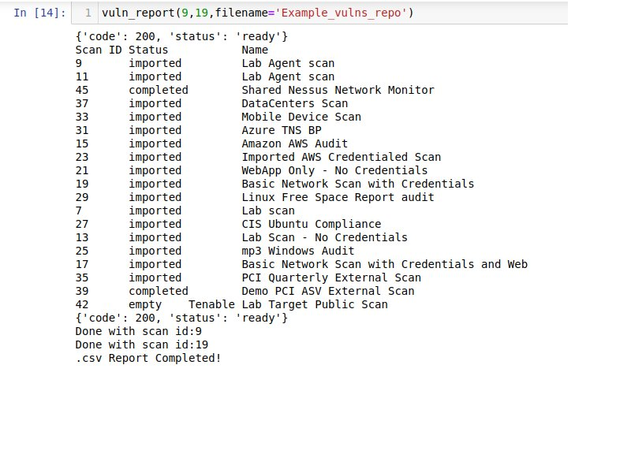

# Pytenable

This repo will have updated versions of the functions and libraries created for MPIV using Pytenable, Navi or Tenable API's

## MPIV Library

Generally speaking, all API projects will be created as functions that can be used according to specific needs. By using functions, we simplify the usage for customers and we can have more control on the user input, also easing reusing code for different projects.

Current status of MPIV library is at: https://github.com/jumedata/pytenable - Only accesible to Oporto, Garcia and me:

Current available functions are:

**connect_IO():** To connect to Tenable IO  
**show_scans():** show all scans available  

**vul_report(\*args, filename):** generate .csv reports  

**get_asset_list:()** return the assets in a Python list, each asset as a dict  
**get_tag_list():** return the tags in a Python list, each tag as a dict  
**asset_repot(filename):** generate a csv report of all assets in T.io  
**tag_exist(category, value):** returns True if tag value pair category/value exists  
**tag_summary()** print a summary of the tags in T.io  

